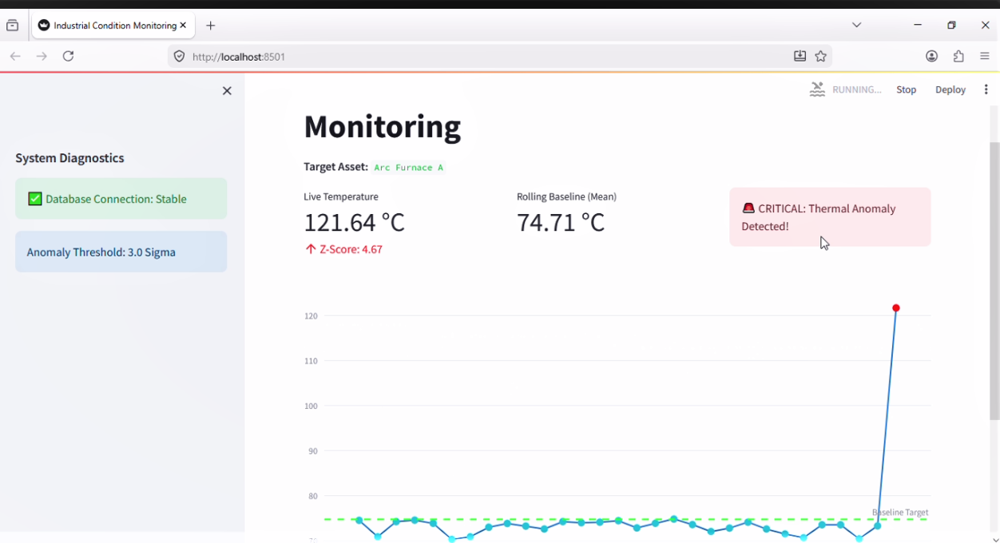

# Industrial Thermal Telemetry Anomaly Detection System

A production-ready, modular real-time anomaly detection pipeline designed for industrial IoT thermal sensors. This system simulates high-frequency thermal telemetry, processes streams using an ultra-efficient online algorithm, and persists anomalous events for industrial auditing.

## 🏗️ System Architecture & Directory Structure
The project follows a clean, modular software engineering architecture separating configuration, core algorithmic logic, and the presentation layer:

```text
industrial-anomaly-detector/
│
├── config/
│   ├── __init__.py
│   └── db_config.py       # Database credentials & pooling configuration
│
├── src/
│   ├── __init__.py
│   ├── database.py        # MySQL logging & persistence layer
│   └── algorithms.py      # Welford's online anomaly detection logic
│
├── app.py                 # Streamlit application entry point
├── .gitignore             # Environment and cache exclusions
├── requirements.txt       # Project dependency manifest
└── README.md              # Project documentation
```
## 🚀 Key Features
*   **Real-Time Data Streaming:** Simulates continuous industrial thermal sensor telemetry with dynamic noise and structural anomalies.
*   **$O(1)$ Online Analytics:** Implements Welford's algorithm for real-time mean and variance tracking without statistical drift.
*   **Persistent Auditing:** Dedicated MySQL schema logging for high-fidelity anomaly history.
*   **Interactive Dashboard:** Streamlit UI featuring live Plotly telemetry graphs with dynamic threshold boundary visualization.

---

## 🧮 Mathematical Foundation: Welford's Online Algorithm

In industrial IoT systems, retaining historical data arrays in memory to calculate moving statistics introduces significant memory overhead ($O(N)$ space complexity) and numerical instability.

This pipeline utilizes **Welford's algorithm** for computing cumulative variance in a single pass. It updates the mean $\mu$ and the squared distance sum $M_2$ at step $n$ with an incoming data point $x_n$ using the following recurrence relations:

$$\mu_n = \mu_{n-1} + \frac{x_n - \mu_{n-1}}{n}$$

$$M_{2,n} = M_{2,n-1} + (x_n - \mu_{n-1})(x_n - \mu_n)$$

The running sample variance $\sigma_n^2$ is then derived instantly:

$$\sigma_n^2 = \frac{M_{2,n}}{n - 1}$$

* **Time Complexity:** $O(1)$ per incoming stream sample.
* **Space Complexity:** $O(1)$ auxiliary space (stores only 3 scalar values: $n$, $\mu$, and $M_2$).
* **Anomaly Threshold:** Any telemetry point where $|x_n - \mu_n| > k \cdot \sigma_n$ (defaulting to $k = 3$) is flagged and quarantined.

---

## 🛠️ Tech Stack

* **Language:** Python 3.10+
* **Frontend Dashboard:** Streamlit, Plotly
* **Database:** MySQL (Persistent storage)
* **Core Logic:** Custom pure-Python mathematical modules

---
## 📺 Product Demo: Real-Time Anomaly Detection

Click the image below to watch the 15-second demo of the industrial anomaly detection pipeline in action, showing live telemetry filtering using Welford's algorithm and dynamic anomaly tagging.

[](https://youtu.be/NLRtRIh5I2k)
---

## 💻 Installation & Setup

### 1. Clone the Repository
Open your terminal or Git Bash and run:
```bash
git clone [https://github.com/helishia20/industrial-anomaly-detector.git](https://github.com/helishia20/industrial-anomaly-detector.git)
cd industrial-anomaly-detector
```
### 2. Set Up the Virtual Environment
Create and activate a isolated Python environment to manage dependencies:

# Create the virtual environment
```
python -m venv venv
```
# Activate on Windows (Command Prompt):
```
venv\Scripts\activate
```
 ### 3. Install Dependencies
Install all required production and UI libraries listed in the manifest:
```
Bash
pip install -r requirements.txt
```
### 4. Database Setup
Ensure your local MySQL server is running. Open your database client (e.g., DataGrip) and execute the following command to initialize the project schema:

SQL:
```
CREATE DATABASE industrial_db;
```
Note: Ensure your database user credentials and host configurations match in config/db_config.py.

### 5.🏃‍♂️ How to Run
The application runs in two parallel streams:

Start the Data Simulator & Analytics Pipeline (Terminal 1):
```Bash
python -m src.data_simulator
```
Launch the Live Monitoring Dashboard (Terminal 2):
```Bash
streamlit run app.py

```

---

## 📄 License
This project is licensed under the MIT License - see the [LICENSE](LICENSE) file for details.

## 👥 Authors
*   **Elham** - *Core Architecture & Development* - [helishia20](https://github.com/helishia20)

---
> 💡 *Developed for technical evaluation and demonstrating production-ready real-time anomaly detection pipelines.*

---

